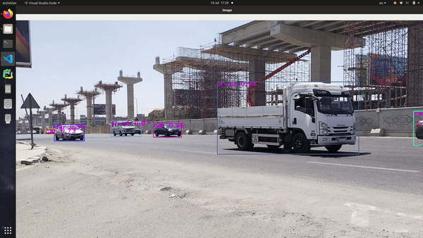
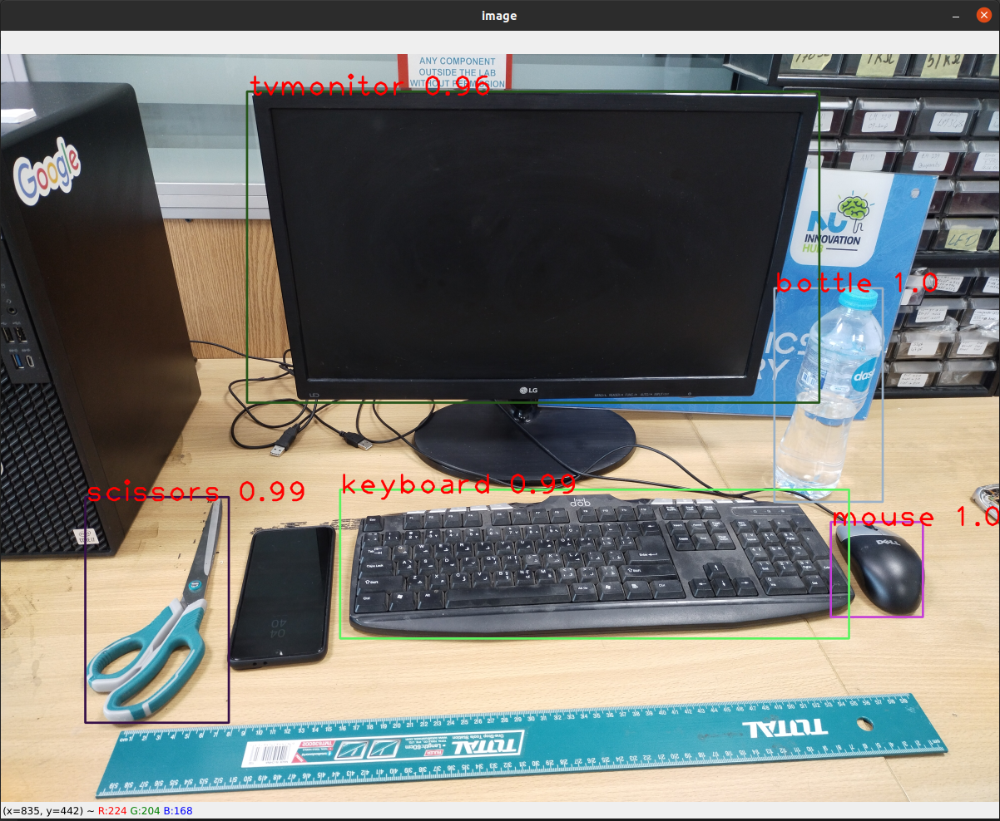
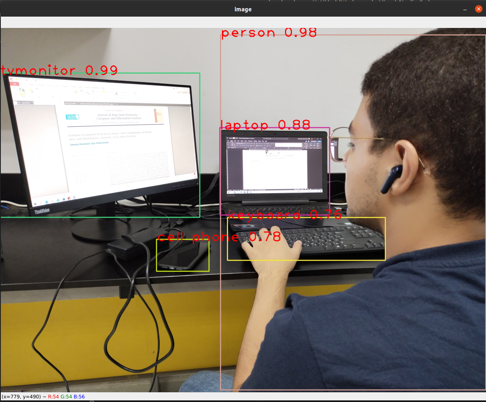
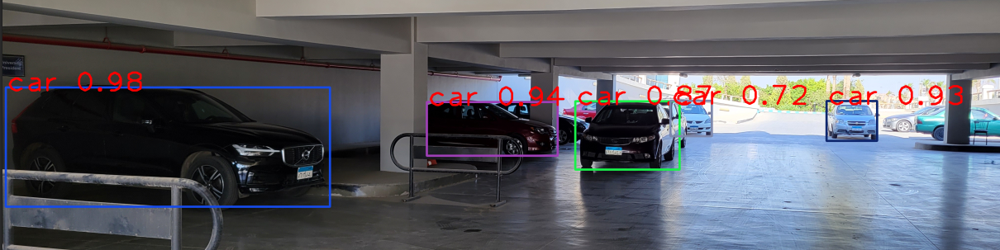

## **YOLOv3 trained model**

Nada Abbas February 14, 2023

YOLOv3 is a SOTA (state-of-the-art) real-time Object Detection model. It was published in April 2020 by Alexey Bochkovsky; it is the 4th installment to YOLO. It achieved SOTA performance on the COCO dataset which consists of 80 different object classes. YOLO is a one-stage detector. The One- stage method is one of the two main state-of-the-art methods used for the task of Object Detection, which prioritizes on the inference speeds. In one-stage detector models ROI (Region of Interest) is not selected, the classes and the bounding boxes for the complete image is predicted. Thus, this makes them faster than two-stage detectors. Other examples are FCOS, RetinaNet, SSD. It divides the object-detection task into regression task followed by a classification task. Regression predicts classes and bounding boxes for the whole image in single run and helps to identify the object position. Classification determines the object’s class. The following set of images shows in details the model created based on YOLOv3 algorithm output.

Figure 1: Input live samples for YOLOv3

